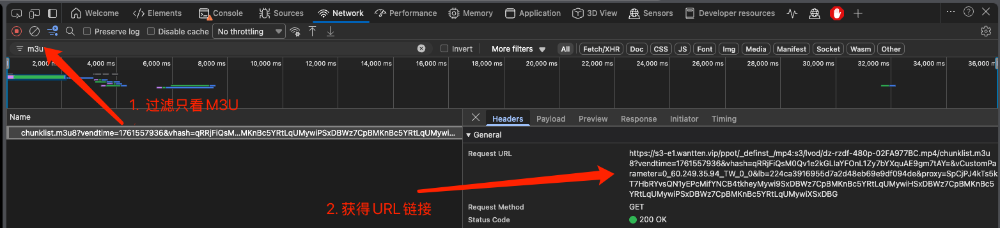
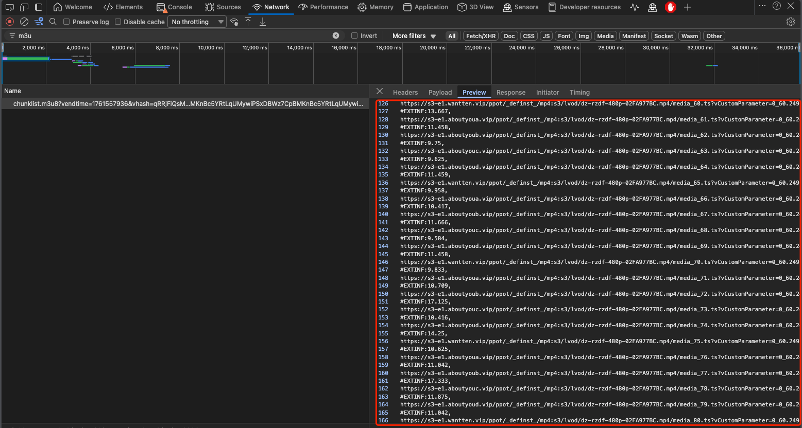

# Python M3U下载脚本介绍

增加获取得到的M3U资源链接，以列表的形式填入到[data集合](../../src/download/data.py)中，如下所示：

```python
[
    {
        "url": "https://s3-e1.wantten.vip/ppot/_definst_/mp4:s3/lvod/dz-rzdf-480p-02FA977BC.mp4/chunklist.m3u8?vendtime=1761557672&vhash=1on5OHA94Gxgkv1ebEEYCSrMm8A_AyBeUnsWKyQUbt0=&vCustomParameter=0_61.216.165.29_TW_0_0&lb=224ca3916955d7a2d48eb69e9df094de&proxy=SpCjPJ4kTs5kT7HbRYvsQN1yEPcMifYNCB4tkheyMywi9SxDBWz7CpBMKnBc5YRtLqUMywiHSxDBWz7CpBMKnBc5YRtLqUMywiPSxDBWz7CpBMKnBc5YRtLqUMywiXSxDBG",
        "name": "让子弹飞"
    },
    {
        "url": "https://s8-e1.useeten.vip/ppot/_definst_/mp4:s8/hvod/kh-xjcy-1-02A635E36.mp4/chunklist.m3u8?vendtime=1761557762&vhash=wiAd6zvrIZ_eF8fOUFtOmpcLhuXZFk0dn46zX2yiMkc=&vCustomParameter=0_125.227.86.44_TW_0_0&lb=e061516cc29415d7d70e0af786ec8dc8&proxy=SpWjPJ4kTNDbPNHbRYvsQN1yEPmMifYNEx2tEZUtCfSxDBWz7CuBMKnBdTXRdHqTsyNEpIuFZcS5hAObpkmjpewD3aoifSxDBWz7CuBMKnBdTXRdHcRtLoBdPfS0",
        "name": "星际穿越"
    }
]
```

如何寻找这个M3U的视频资源？

打开浏览器，尽可能使用Chromium内核的浏览器，比如Chrome、Edge，进入Developer Tools，然后使用Network过滤出来m3u的资源



（多一步确认到底是不是合法的M3U链接，如果是下面这种格式的Preview，那就是正确的M3U）


- 执行代码

确保已经在src/download的路径之下
```bash
python ./download.py
```